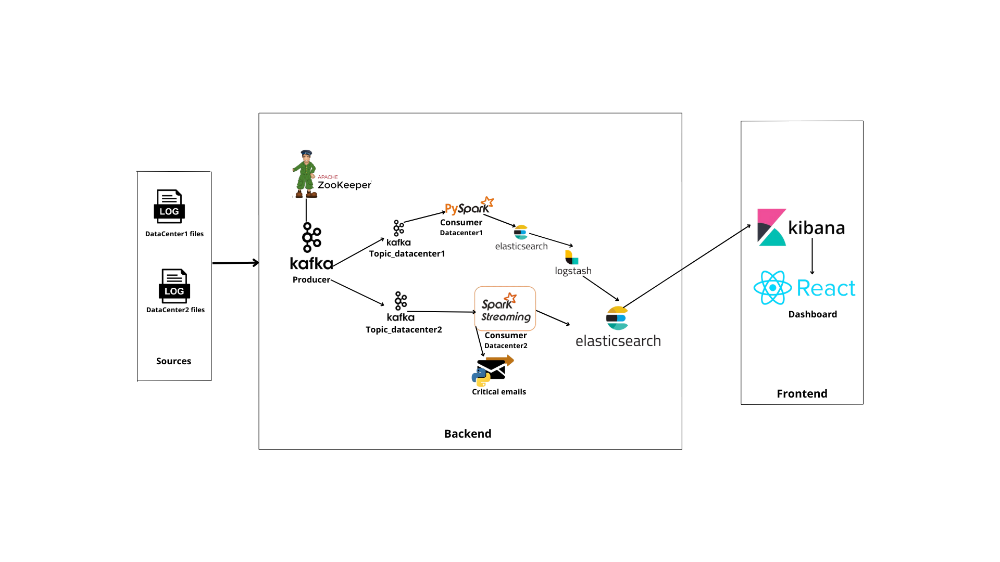

# LogMonitoringSystem 📊🔍  
*Real-Time & Batch Log Monitoring System with Lambda Architecture*

## 📌 Overview  
LogMonitoringSystem is a log monitoring platform for Hadoop datacenters, implementing a **Lambda Architecture**:  
- **Batch Processing**: Non-critical logs (Datacenter 1).  
- **Real-Time Processing**: Critical error logs (Datacenter 2) + email alerts.  
- **Visualization**: Kibana dashboards and React web interface.  

## ✨ Features  
- **Data Ingestion**: Kafka integration for log streaming.  
- **Processing**:  
  - Batch: PySpark + Logstash (Grok patterns).  
  - Real-Time: Spark Streaming + error filtering.  
- **Storage**: Elasticsearch indexing by date and datacenter.  
- **Alerts**: Email notifications for critical errors.  
- **Visualization**: Kibana dashboards + React web interface.  

## 🛠 Architecture  
  
1. **Batch Layer**:  
   - Kafka Producer → Spark Batch → Logstash → Elasticsearch → Kibana.  
2. **Speed Layer**:  
   - Kafka Producer → Spark Streaming → Filtering → Elasticsearch + Alerts(emails)  → Kibana.  
3. **Web Interface**: React connected to Elasticsearch/Kibana.  
 

## 🚀 Installation  
```bash
# Clone the repository
https://github.com/HanaMzoughi/LogMonitoringSystem-.git
cd LogMonitoringSystem-
